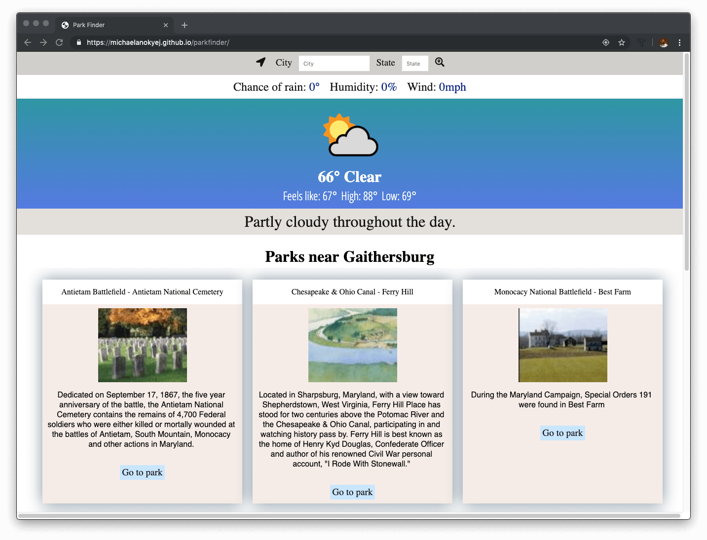
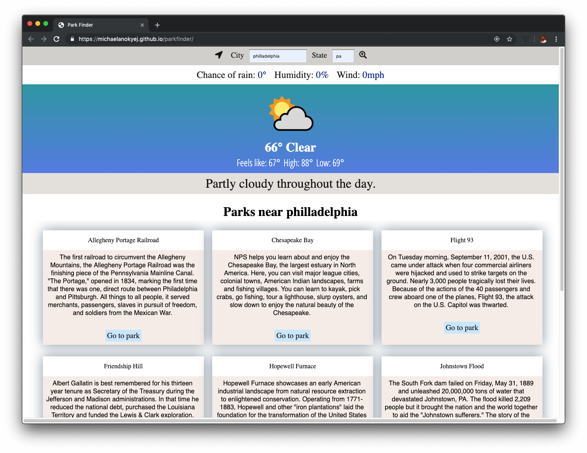
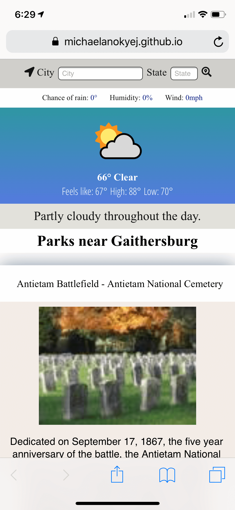
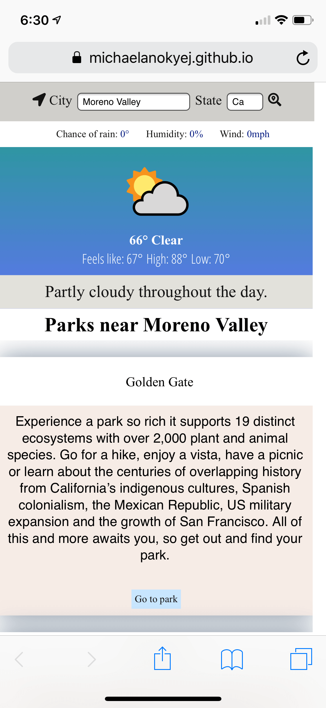

<!-- # parkfinder

Initial wireframes:

https://github.com/michaelanokyej/parkfinder/tree/master/assets/planning
-->
# Parkfinder WebApp

An andventure driven web-app that searches for parks. Users can search for national parks in and out of their states. Parks are always shown with the current weather and the weather throughout the day for the location.  

## Motivation

I wanted to create an app that will tell me about all the national parks near me regardless where I am and give me a link to the park's website.

## Screenshots
Desktop Landing Page:

Desktop Search Results:

Mobile Landing Page:

Mobile Search Results Page:

## Built With
* Html
* CSS
* JavaScript
* jQuery

## Features

* Gets weather at the current location
* Gets parks near user current location
* User can search for parks anywhere
* Results of user search is displayed with the weather

## Demo

- [Live Demo](https://michaelanokyej.github.io/parkfinder/)

## Author

* **Michael Anokye** 